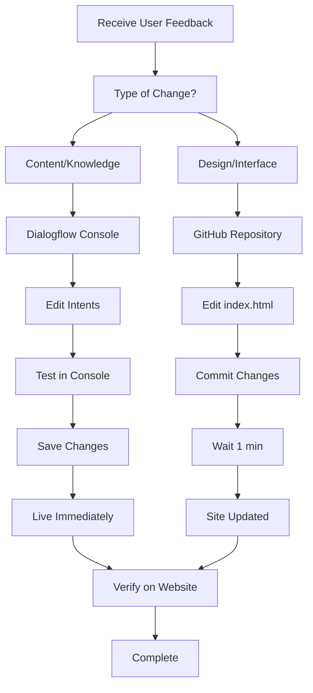

# 💻 TechSakhi: AI Coding Assistant for Rural Pakistani Women


**Live Website:** 🌐 [https://nimranoor99.github.io/TechSakhi_Pakistan/](https://nimranoor99.github.io/TechSakhi_Pakistan/)

**TechSakhi** is an AI-powered chatbot designed to provide free coding education to rural women in Pakistan. The platform offers 24/7 assistance for learning HTML, CSS, Python, and other digital skills in Urdu and English.

## 🎯 Project Vision

> *"Empowering rural Pakistani women through accessible digital education, enabling them to participate in the global digital economy."*

## ✨ Features

### 🤖 **AI-Powered Chatbot**
- 24/7 availability for coding questions
- Voice and text input support
- Urdu and English language support
- Beginner-friendly explanations

### 📚 **Learning Areas**
- **HTML/CSS** - Website development basics
- **Python** - Programming fundamentals
- **JavaScript** - Interactive web elements
- **Career Guidance** - Digital job opportunities
- **Technical Support** - Installation help, error solving

### 📱 **Accessibility**
- Mobile-responsive design
- Works on low-bandwidth connections
- No registration required
- Completely free forever

## 🚀 Live Deployment

Your project is live on **GitHub Pages**:
- **Website URL:** [https://nimranoor99.github.io/TechSakhi_Pakistan/](https://nimranoor99.github.io/TechSakhi_Pakistan/)
- **GitHub Repository:** [https://nimranoor99.github.io/TechSakhi_Pakistan/](https://nimranoor99.github.io/TechSakhi_Pakistan/)

## 🛠️ Technology Stack

| Component | Technology Used |
|-----------|----------------|
| **Frontend** | HTML5, CSS3, JavaScript |
| **Chatbot** | Google Dialogflow ES |
| **Hosting** | GitHub Pages |
| **Styling** | Custom CSS with Animations |
| **Icons** | Font Awesome 6 |

## 🔧 Setup & Installation

### For Users:
Simply visit: [https://nimranoor99.github.io/TechSakhi/](https://nimranoor99.github.io/TechSakhi_Pakistan/)

### For Developers:
1. Clone the repository:
   ```bash
   git clone https://github.com/nimranoor99/TechSakhi.git
2. Open index.html in any browser
3. No additional dependencies required

## 🤖 Dialogflow Agent Management

### Agent Details:
- **Agent ID:** `02710e17-84ae-46fc-9928-0b2c660cf29c`
- **Project:** `coding-assistant-for-rural-women`
- **Environment:** `production`
- **Access URL:** [Dialogflow Console](https://dialogflow.cloud.google.com)

### 🔄 Update Workflow

#### For Content Updates (Most Common):
1. **Login to** [Dialogflow Console](https://dialogflow.cloud.google.com)
2. **Navigate to Intents**
3. **Add/Edit questions and responses**
4. **Click "Save"** → Changes are live immediately
5. **No website updates required**

#### For Major Changes:
1. **Test in Dialogflow** test console first
2. **Deploy to production** environment
3. **Verify on live website** in incognito mode


## 🔧 Troubleshooting Common Issues
Chatbot not responding	-> Check Dialogflow agent is published
Microphone not working	-> Ensure HTTPS and permissions
"Agent not found" error	-> Verify Agent ID is correct
Slow responses	-> Check network, reduce payload size
Mobile display issues	-> Test iframe responsiveness

## 📈 Performance Optimization Tips
1. Keep intents organized with clear naming
2. Use entities for parameter extraction
3. Add variety to training phrases
4. Test with real users regularly
5. Monitor fallback intent for gaps in knowledge

## 🔐 Security Considerations
- Agent is public (no sensitive data in responses)
- Web Demo is read-only (users can't modify agent)
- No user data storage (privacy-focused)
- HTTPS enforced (secure connections)

## 📱 Multi-Platform Support
Current Integration:

✅ Website (GitHub Pages)

✅ All modern browsers

✅ Mobile devices

## Future Expansion Options:

✅ WhatsApp integration via Twilio

✅ Telegram bot

✅ SMS-based interface for low-connectivity areas

✅ Mobile app with React Native

## ❓ FAQ - Agent Management
### Q: How often should I update the agent?
A: Weekly for new content, monthly for major improvements.

### Q: Can multiple people edit the agent?
A: Yes, add collaborators in Dialogflow settings.

### Q: What if I lose access to Dialogflow?
A: Regular ZIP exports serve as backups.

### Q: How to handle inappropriate questions?
A: Fallback intent redirects to coding topics.

### Q: Can I see who's using the chatbot?
A: No personal data is collected, only aggregate analytics.

## 📞 Support Resources
- Dialogflow Documentation: https://cloud.google.com/dialogflow/docs
- Community Forum: https://stackoverflow.com/questions/tagged/dialogflow
- GitHub Issues: For website-related problems
- Email Support: For critical issues


## 📊 Project Impact
### Target Audience: 
- Rural women in Pakistan aged 16-40
- Beginners with no coding experience
- Aspiring digital freelancers
- Women seeking remote work opportunities

### Learning Outcomes:
- Basic website creation skills
- Understanding of programming concepts
- Awareness of digital career paths
- Confidence in using technology

## 🔄 Complete Update Workflow


  
  
## 🤝 Contributing
While this is a personal project, suggestions are welcome:
1. Report Issues: Use GitHub Issues
2. Suggest Features: What would help rural women learn better?
3. Content Ideas: Relevant coding topics for beginners
4. Translation Help: Urdu language improvements

### Contribution Guidelines:
- Fork the repository
- Create a feature branch
- Make changes with clear comments
- Submit a pull request
- Wait for review

## 📝 License
This project is open source and available under the MIT License.

```
MIT License
Copyright (c) 2024 TechSakhi Pakistan
Permission is hereby granted, free of charge...
```
## 🙏 Acknowledgments
- Google Dialogflow for the AI chatbot platform
- GitHub for free hosting via GitHub Pages
- Font Awesome for beautiful icons
- All rural women learners who inspired this project
- Open source community for tools and inspiration

## 📬 Contact & Support
- GitHub: @nimranoor99
- Live Support: Chatbot available 24/7 on website
- Project Status: Active and maintained
- Last Updated: February 2024

### Support Channels:
- Technical Issues: GitHub Issues
- Content Suggestions: Dialogflow improvements
- General Questions: Chatbot itself
- Collaboration: GitHub Discussions

### Response Time:
- Urgent issues: 24-48 hours
- Feature requests: 1 week
- General questions: Via chatbot 24/7

<div align="center"> 
